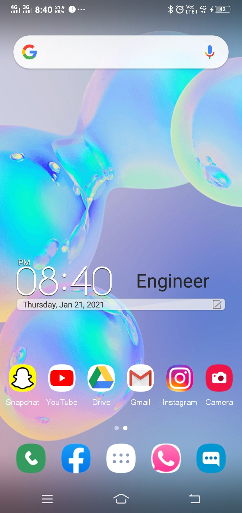

# Samsung-Mobile-UI-Design
<!DOCTYPE html>
<html lang="en">
<head>
    <meta charset="UTF-8">
    <meta name="viewport" content="width=device-width, initial-scale=1.0">
    <title>Samsung UI Design</title>
    <link rel="stylesheet" href="style.css">

</head>
<body>
    

        

           
            

        

    

</body>
</html>
